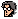
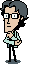

# OtaClaw for OpenClaw

[](https://github.com/U-N-B-R-A-N-D-E-D/otaclaw/actions)
[](https://opensource.org/licenses/MIT)
[](https://github.com/U-N-B-R-A-N-D-E-D/otaclaw)
[](https://nodejs.org)
[](https://github.com/U-N-B-R-A-N-D-E-D/openclaw)

<p align="center">
  
</p>

<p align="center">
  <strong>Hal as the face of OpenClaw</strong><br>
  Self-hosted, your data stays local. Give your AI assistant a face that reacts to every interaction.
</p>

<p align="center"><strong>[ U N B R A N D E D ]</strong> - 2026</p>

<p align="center">
  <a href="INSTALL.md">Install</a> •
  <a href="QUICKSTART.md">Quick Start</a> •
  <a href="#two-modes">Two Modes</a> •
  <a href="#features">Features</a> •
  <a href="#installation">Installation</a> •
  <a href="#api">API</a>
</p>

---

## What is OtaClaw?

<p align="center">
  
</p>

OtaClaw is a **visual face for OpenClaw** — an animated companion that accompanies your interactions with the gateway. Instead of a simple clock like the original [Kojima Productions Otaclock](https://metalgear.fandom.com/wiki/Otaclock), this version reacts to OpenClaw events with expressive animations, giving you a visual accompaniment for every exchange.

Your AI now has NES-style reactions:
- **Hmmm....** when thinking
- **Processing** while generating
- **Got it!** on success
- **Woah!** when surprised (e.g. tool call)
- **Haha!** / **Oops...** for laugh/error

Perfect for:
- **Raspberry Pi + Touchscreen** – Physical AI face
- **Kiosk displays** – Visual feedback for OpenClaw (responsive: small to large screens)
- **Desktop dashboards** – Always-on status
- **Floating widget** – Embed in corners, sidebars, any UI via iframe

---

## Prerequisites

- **OpenClaw** – OtaClaw is a face for OpenClaw; the gateway must be running first.
  - Install: `npm install -g openclaw`
  - Setup: `openclaw onboard` (or see [docs.openclaw.ai](https://docs.openclaw.ai))
- **Node.js 16+** – For dev server (`npm start`) and OpenClaw
- **Bash** – Deploy script requires bash (Linux, macOS, or WSL/Git Bash on Windows)

---

## Quick Start

```bash
git clone https://github.com/U-N-B-R-A-N-D-E-D/otaclaw.git
cd otaclaw
./deploy/deploy-to-openclaw.sh --local
```

The deploy script outputs a **local network URL with token** — open it from any device on your LAN (Mac, phone, tablet) to see Hal connected to your OpenClaw.

Remote deploy: `./deploy/deploy-to-openclaw.sh --host=YOUR_OPENCLAW_HOST --user=YOUR_USER`

**Dev server (no OpenClaw):** `npm start` or `npx serve src -p 8080` from repo root, then deploy when gateway is ready.

See [QUICKSTART.md](QUICKSTART.md) for the two display modes.

---

## Two Modes

| Mode | Use case |
|------|----------|
| **A) Resizable widget** | Floating window on Linux desktop, embeddable iframe, sidebar |
| **B) Fullscreen + rotation** | Dedicated display (Pi, tablet), with rotation and backdrop controls |

Mode B: Long-press or tap ⚙ for Face rotation, Full window, Backdrop color.

---

## Features

### Emotional States
| State | Trigger | Animation |
|-------|---------|-----------|
| **Idle** | No activity | Gentle breathing, occasional blink |
| **Thinking** | Message received | Hands on head, thinking pose |
| **Processing** | Generating response | Eyes moving, concentration |
| **Success** | Response complete | Thumbs up, big smile |
| **Error** | Error/timeout | Crying animation |
| **Laughing** | Humor detected | Laughing with closed eyes |
| **Surprised** | Tool call | Wide eyes, shocked expression |

### Technical Features
- 🎯 **WebSocket** – Real-time reaction to OpenClaw events
- 📱 **Touchscreen** – Raspberry Pi displays
- ⚡ **Lightweight** – Vanilla HTML/CSS/JS, no frameworks
- 🔧 **Configurable** – States, sprites, event mapping, i18n
- 🖼️ **Sprite catalog** – 48 frames, tag-based semantic selection
- 📦 **Widget mode** – Embeddable via iframe (`widget.html`)
- 🌐 **Full emotional range** – Tag-to-frame mapping for worried, waving, scared, confident, wink, etc.

---

## Installation

### Requirements

- [OpenClaw](https://github.com/openclaw/openclaw) installed and running
- Modern web browser (Chrome, Firefox, Safari, Edge)
- For Raspberry Pi: Chromium browser + touchscreen (optional)

**Windows:** Deploy requires bash (WSL or Git Bash). Dev server (`npm start`) works with Node.js.

### Deploy to OpenClaw Canvas

**Same machine (OOTB with Clawdbot):**
```bash
git clone https://github.com/U-N-B-R-A-N-D-E-D/otaclaw.git
cd otaclaw
./deploy/deploy-to-openclaw.sh --local
```

**Remote host:**
```bash
./deploy/deploy-to-openclaw.sh --host=YOUR_OPENCLAW_HOST --user=YOUR_USER
```

Config uses `host: 'auto'` by default so WebSocket host follows the current page host.

### Full-Screen Display (Kiosk)

For a dedicated display (Raspberry Pi, tablet, second monitor):

```bash
# Quick: Chromium kiosk
chromium-browser --kiosk --app=http://localhost:18789/__openclaw__/canvas/otaclaw/
```

See [deploy/kiosk-mode.md](deploy/kiosk-mode.md) for systemd service, auto-start, and platform-specific setups.

### Widget / Embed

Use OtaClaw as a floating widget in other UIs:

```html
<!-- iframe embed -->
<iframe src="http://localhost:18789/__openclaw__/canvas/otaclaw/widget.html"
  width="200" height="300" style="border:none; border-radius:12px;"></iframe>
```

See [docs/OPENCLAW-INTEGRATION.md](docs/OPENCLAW-INTEGRATION.md) for:
- Emitting `otaclaw.frame` for semantic reactions (tag or col,row)
- Clawdbot/agent integration
- Tag-to-frame catalog and `config.sprites.tagToFrames`
- [docs/OTACLAW-AGENT.md](docs/OTACLAW-AGENT.md) – Agent prompt template for full emotional range

---

## Configuration

### Basic Configuration

Edit `config/config.js`:

```javascript
export const OTACLAW_CONFIG = {
  // OpenClaw Gateway connection
  openclaw: {
    host: 'auto',               // Use current page host (recommended)
    port: 18789,                // OpenClaw gateway port
    wsPath: '/ws',              // WebSocket endpoint
    reconnectInterval: 5000,    // Reconnect every 5s if disconnected
    heartbeatInterval: 45000,   // Lower network/CPU cost
    staleThreshold: 120000,     // Force reconnect if connection is stale
    maxQueuedMessages: 120,     // Prevent offline queue memory growth
  },
  
  // Behavior settings
  behavior: {
    idleTimeout: 30000,       // Return to idle after 30s
    animations: true,         // Enable CSS animations
    lowPowerMode: true,       // Disable costly flash/pop effects
    sounds: false,            // Sound effects (requires interaction)
    touchEnabled: true,       // Touch interactions
    debug: false,             // Show debug info
  },
  
  // Available states
  states: [
    'idle', 
    'thinking', 
    'processing', 
    'success', 
    'error', 
    'laughing', 
    'surprised'
  ],
  sprites: {
    basePath: 'assets/sprites/',
    sheetFile: 'otaclock-original',
    format: 'png',           // png | webp
    sheetWidth: 567,
    sheetHeight: 278,
    cellWidth: 47,
    cellHeight: 70,
    displayTargetHeight: 320,
    idleBaseDelayMs: 3000,
    idleJitterMs: 1200,
  },
};
```

### Hal (Otacon) personality

Set `personality: 'hal'` in config to use Hal Emmerich–inspired speech — varied, nerdy, loyal reactions from the Metal Gear Solid character. See [docs/PERSONALITY-HAL.md](docs/PERSONALITY-HAL.md).

### Customization

See [docs/CUSTOMIZATION.md](docs/CUSTOMIZATION.md) for:
- Creating custom sprites
- Adding new emotional states
- Changing animations
- Theming (colors, sizes)

---

## API

### WebSocket Events

OtaClaw listens for these events from OpenClaw:

| Event | Description | State |
|-------|-------------|-------|
| `agent.message.start` | Processing started | `thinking` |
| `agent.message.delta` | Token streaming | `processing` |
| `agent.message.complete` | Response complete | `success` |
| `agent.message.error` | Error occurred | `error` |
| `agent.tool.call` | Tool executed | `surprised` |
| `gateway.idle` | Gateway idle | `idle` |

### Programmatic API

```javascript
// Get OtaClaw instance
const otaclaw = window.otaclaw;

// Set state manually
otaclaw.setState('thinking');

// Listen for state changes
otaclaw.on('stateChange', (newState, oldState) => {
  console.log(`Changed from ${oldState} to ${newState}`);
});

// Send message to OpenClaw
otaclaw.send({
  type: 'chat.message',
  content: 'Hello!'
});
```

Full API documentation: [docs/API.md](docs/API.md)

---

## Hardware Support

### Tested Configurations

| Device | Screen | Touch | Status |
|--------|--------|-------|--------|
| Raspberry Pi 4 | Official 7" Touchscreen | ✅ | Fully supported |
| Raspberry Pi 3B+ | HDMI + USB Touch | ✅ | Fully supported |
| Raspberry Pi Zero 2 W | Waveshare 3.5" LCD | ✅ | Supported |
| Desktop PC | Any monitor | ❌ | Supported |
| Mac | Any monitor | ❌ | Supported |

See [docs/HARDWARE.md](docs/HARDWARE.md) for detailed guides.

---

## Sprites & Assets

### Included Sprites

The default sprite set uses placeholder graphics. You can replace them with:

1. **Original Otacon sprites** from Metal Gear Solid (fan-made recreations)
2. **Custom pixel art** in the same style
3. **3D renders** converted to sprite sheets
4. **Any character** you want as your AI face

### Sprite Format

Each state needs:
- `assets/sprites/{state}/frame-1.png`
- `assets/sprites/{state}/frame-2.png`
- ... (as many frames as needed for animation)

Recommended: PNG with transparency, 256x256px minimum.

---

## Contributing

We welcome contributions! See [CONTRIBUTING.md](CONTRIBUTING.md) for guidelines.

### Development Setup

```bash
# Clone repository
git clone https://github.com/U-N-B-R-A-N-D-E-D/otaclaw.git
cd otaclaw

# Install dev dependencies (optional, for npm scripts)
npm install

# Serve locally for development
npm start
# Or: npx serve src -p 8080
# Open http://localhost:8080/
```

---

## License

MIT - see [LICENSE](LICENSE). [NOTICE](NOTICE) for credits.

**Credits:** Otaclock/Otacon © Kojima Productions / Konami. Non-commercial, 100% open source fan project. No affiliation. No warranty.

---

<p align="center">[ U N B R A N D E D ] - 2026</p>
